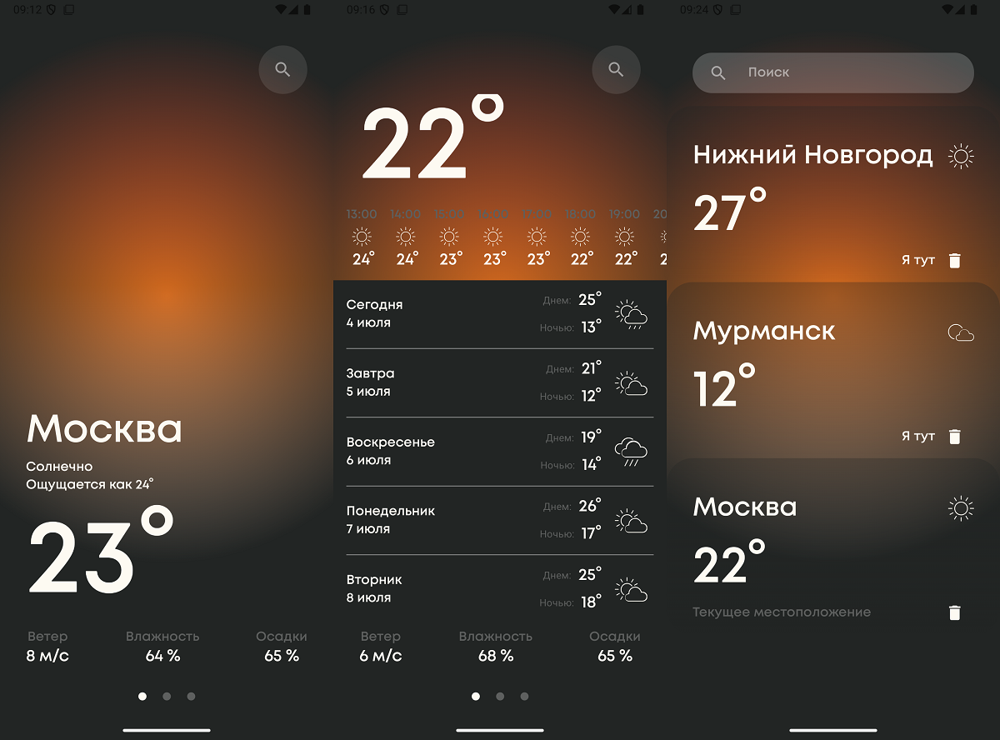
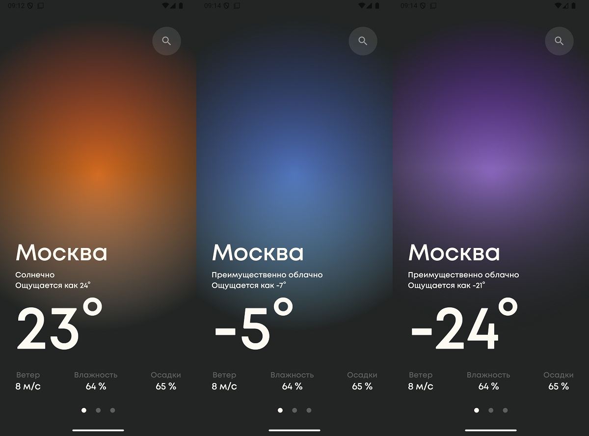

# Weather App

Android приложение для просмотра погоды, использующее AccuWeather API.

## Настройка проекта

### API Ключи

Для работы с приложением необходимо настроить API ключи. Следуйте этим шагам:

1. Получите API ключ на [AccuWeather API](https://developer.accuweather.com/)
2. Откройте файл `local.properties`
3. Добавьте в конец файла:

```properties
ACCUWEATHER_API_KEY=your_api_key_here
```
- Gradle создаст файл BuildConfig, где будет api_key.
- Для смены api_key нужно поменять его в local.properties и сделать clean, build

### Важно
- Для единичной проверки работоспособности вы можете использовать ключ `2FXHaoGutYQIyfep3DyqedVbXOMgJAmH`, однако он ограничен 50 запросов/день
- Если вы получаете ошибку с кодом 503, значит лимит запросов закончился.
- При отсутствии необходимых ключей сборка проекта завершится с ошибкой

## Дизайн

Почасовой и дневной прогноз.


Каждой погоде назначается свой цвет фона.



## Архитектура

Приложение построено с использованием Clean Architecture и включает следующие слои:

- Domain: бизнес-логика и модели
- Data: реализация репозиториев и работа с данными
- Presentation: UI компоненты и ViewModels

## Используемые технологии

- Kotlin
- Jetpack Compose
- Hilt для Dependency Injection
- Retrofit для сетевых запросов
- Room для кеширования
- Coroutines и Flow
- Clean Architecture
- Unit Tests 